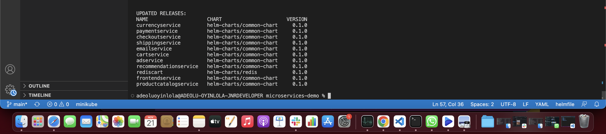
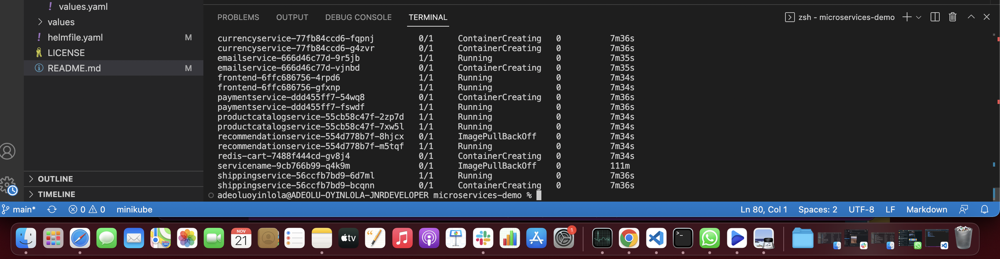
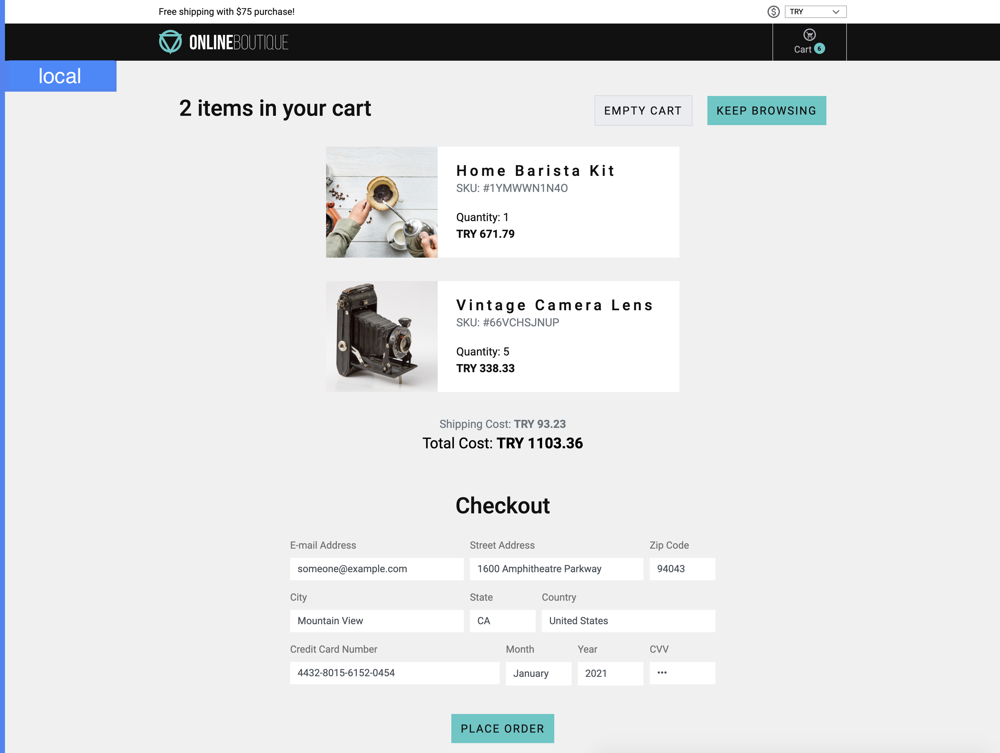

# microservices-demo
How I implemented the sample cloud-native application with 11 microservices showcasing Kubernetes and managed by helm. Original repo; https://github.com/GoogleCloudPlatform/microservices-demo

Must have for this to run; minikube, kubectl, docker, helm, helmfile. Then following these steps;
  - Fork the repo
  - Clone the repo into you local machine
  - cd into the directory
  - Run the command; ```helmfile sync```
  - Check if all the service were deploy correctly, run the command; ```kubectl get pod```
  - Get the url address, first run the command; ```kubectl get svc```
  - Copy the frontendservice name, then run the command; ```minikube service frontendservice```
  - Copy and paste the url address on the browser. Voila!!!

## Table of contents
<!-- TOC -->
* [A journey into microservice](#a-journey-into-microservices)
  * [Problem Statements](#problem-Statements)
  * [Solution](#solution)
  * [Project requirements](#project-requirements)
  * [Demo](#demo)
    * [Prepare kubernetes environment and get helm install](#prepare-k8s-env-and-get-helm-install)
    * [Create a common chart for 10 microservices](#create-a-common-chart-for-10-microservices)
    * [Set default and actual value for each microservices](#set-value-for-each-microservices)
    * [Create redis helm chart](#create-redis-helm-chart)
    * [Deploy microservices to kubernetes with helmfile](#deploy-microservices-to-kubernetes-with-helmfile)
  * [Lesson Learnt](#Lessons)
<!-- TOC -->

## Problem Statements

[Problem Statements](problems): Problem Statements
How can I deploy and manage existing microservices in a kubernetes cluster?

## Solution

The diagram describes my solution in picture as shared in the original repo.

## Project requirements
It is assume that this demo is for learning purpose, so best production and security practices are not fully considered:
- I will deploy 11 microservices with helmfile
- Frontend service - entrypoint for the application that is accessible externally
- Redis - 3rd party service that store data
- All the microservices images, env, port are based on the original repo from gcr sample
- I use a single namespace
- All the microservices commmunicate using API call

## Demo
If you want to follow along this demo, fork the repo. Clone the repo into your local machine. Change into the directory where it was clone to.

[Prepare kubernetes environment and get helm install](#prepare-k8s-env-and-get-helm-install)
  - Set up minikube on your machine and get helm, helmfile install. 
  - Pretty simple process; check out the steps from official doc at https://kubernetes.io/docs/tasks/tools/ and https://helm.sh/docs/intro/install/

[Create a common chart for 10 microservices](#create-a-common-chart-for-10-microservices)
  - I created a common chart for the 10 microservices of the application and later a chart for the 3rd party service, in this case redis. Run the command; ```helm create common-chart```
  - At the creation, the chart will contain the following;
    - chart folder - chart dependencies
    - template folder - dir where actual k8s YAML files created, blueprint
    - Chart.yaml - meta info about the chart
    - values.yaml - default values for the template files
    - .helmignore - files need not include in the helm chart


[Set default and actual value for each microservices](#set-value-for-each-microservices)

  - Need to validate if all the values define is correct up till this point.
  Run the command; ```helm template -f email-service-values.yaml common-chart``` & ```helm lint -f email-service-value.yaml common-chart```
  - Then, deploy one of the service to check if this work.
  Run the command; ```helm install common-chart ./helm-charts/common-chart/``` & ```helm list```

[Create redis helm chart](#create-redis-helm-chart)
  - Same process as when creating common charts but this time for just redis. Run the command; ```helm create redis```
  - Put this redis chart and common chart under same folder - helm-charts

[Deploy microservices to kubernetes with helmfile](#deploy-microservices-to-kubernetes-with-helmfile)
  - Alternative to helmfile is to individually install microservices by running the command; ```helm install -f file.yaml release_name chart_name``` for each services. Imagine doing this for hundred of services, not practical right.
  - Create helmfile.yaml which define the releases for all the microservices.
  - First install helmfile into the machine, I am using macOS, so I ran; ```brew install helmfile```
  - Then run the command; ```helmfile sync``` the result should be similar to image below
  
  - Check with kubectl if all the pods are created, running with ```kubectl get pod```
  
  - Then check the application on the browser through frontend service which serve as entry point
  - By runnning ```kubectl get svc``` to get the address expose externally. Remember I use NodePort as serviceType.
  - I copied the frontendservice name, then run the command; ```minikube service frontendservice```
  - Then again copy and paste the address on the browser. It should display similar image below if all things went well




## Lesson Learnt
  - Helm makes managing microservices more ease, smooth and time-saving
  - One will appreciate helm better if you had previously creating multiple deployment manifest for kubernetes cluster manually
  - Alternative to helm is carvel ytt, more of programmatic approach to packaging and managing microservices
  - There is no one-fit-all kind of solution to problems. It just use case understanding